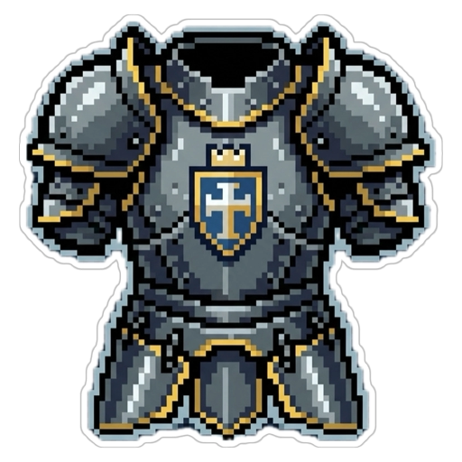

<p align="center">
  
</p>

# ⛏️ Core Keeper Armory

> A desktop companion app for tracking your gear sets and build progression in [Core Keeper](https://store.steampowered.com/app/1621690/Core_Keeper/).

Built for players who hoard six versions of the same armor set "just in case" — and can never remember which pieces they're still missing.

---

## What is this?

Core Keeper Armory is an **Electron + React** desktop app that lets you manage your equipment builds across multiple play sessions and players. Think of it as a personal spreadsheet — but one that knows what a `Mão Secundária` is and won't judge you for having 12 incomplete sets.

**Core features:**
- **Build tracking** — create named equipment sets and mark items as acquired slot by slot (helmet, chest, legs, rings, necklace, backpack, off-hand)
- **Co-op support** — track builds per player, each with their own color and progress
- **Progress overview** — visual progress bars so you can see at a glance how close you are to completing each set
- **In-progress vs. completed** separation on the dashboard
- **Clone builds** — useful when two players are going for the same set
- **Master Ledger** — a spreadsheet-like bulk edit view for when you need to restructure everything after a major boss run
- **Search** — filter by set name or equipment item

---

## Stack

| Layer | Tech |
|---|---|
| Desktop shell | Electron 41 |
| Frontend | React 19 + Vite + TypeScript |
| Styling | Tailwind CSS v4 + Material Design 3 |
| Backend | Node.js + Fastify 5 + TypeScript |
| Data | JSON files via Docker volume |
| State | TanStack Query + React Hook Form |
| Quality | Biome (lint/format) + Vitest |

The backend is a lightweight Fastify REST API running in Docker. Data is persisted as JSON files — no database to set up, no migrations, no fuss.

---

## Installation

Download the latest release from the [Releases page](https://github.com/victorradael/core-keeper-armory/releases).

### Linux (AppImage)

```bash
chmod +x CoreKeeperArmory-*.AppImage
./CoreKeeperArmory-*.AppImage
```

No installation required — the AppImage is self-contained and runs directly.

> If you use **AppImageLauncher**, it will automatically prompt to integrate the app into your system when you open it for the first time.

#### Uninstalling

**Without AppImageLauncher** — delete the file and app data:

```bash
rm CoreKeeperArmory-*.AppImage
rm -rf ~/.config/Core\ Keeper\ Armory
```

**With AppImageLauncher** — right-click the app in your application launcher and select **Remove AppImage from system**. Then remove the app data:

```bash
rm -rf ~/.config/Core\ Keeper\ Armory
```

### Windows (NSIS Installer)

Run the `.exe` installer and follow the prompts.

#### Uninstalling

Open **Settings → Apps**, find **Core Keeper Armory**, and click **Uninstall**. To also remove saved data:

```
rmdir /s "%APPDATA%\Core Keeper Armory"
```

---

## Getting Started

### Prerequisites

- [Docker](https://docs.docker.com/get-docker/) + Docker Compose
- Node.js 20+

### 1. Start the backend

```bash
docker compose up -d
```

The API will be available at `http://localhost:3000`. Verify with:

```bash
curl http://localhost:3000/ping
```

### 2. Start the frontend

```bash
cd frontend
npm install
npm run dev
```

The Electron window will open automatically.

---

## API Reference

The backend exposes a simple REST API if you want to script imports or integrate with other tools:

| Method | Endpoint | Description |
|---|---|---|
| `GET` | `/ping` | Health check |
| `GET` | `/sets` | List all equipment sets |
| `POST` | `/sets` | Create a new set |
| `PATCH` | `/sets/:id/items/:key` | Toggle item acquisition |
| `DELETE` | `/sets/:id` | Delete a set |
| `POST` | `/sets/:id/clone` | Clone a set |
| `GET` | `/catalog` | List available equipment slots |
| `GET` | `/config` | Load app config |
| `POST` | `/config` | Save app config |

---

## Equipment Slots

The app tracks the 8 Core Keeper equipment slots:

| Key | Slot |
|---|---|
| `capacete` | Helmet |
| `peitoral` | Chest |
| `calças` | Legs |
| `anel_1` | Ring 1 |
| `anel_2` | Ring 2 |
| `colar` | Necklace |
| `mochila` | Backpack |
| `mao_secundaria` | Off-hand |

---

## Project Structure

```
core-keeper-armory/
├── backend/        # Fastify API + business logic
├── frontend/       # Electron + React app
├── data/           # JSON persistence (mounted via Docker volume)
└── specs/          # Technical specs and planning docs
```

---

## Contributing

This is a personal project, but PRs and issues are welcome — especially if you play Core Keeper and have opinions about how builds should be organized.

Check `specs/` for the technical roadmap and design decisions.
